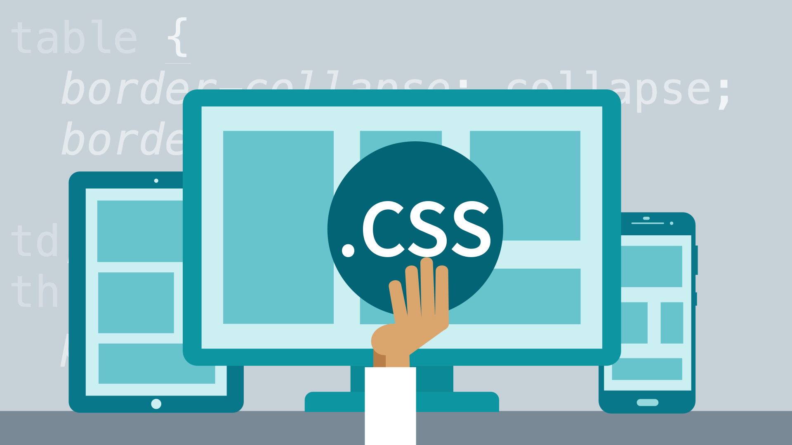

## CSS

*Cascading Style Sheets (CSS) is a style sheet language used for describing the presentation of a document written in a markup language such as HTML.CSS is a cornerstone technology of the World Wide Web, alongside HTML and JavaScript.*

*CSS is designed to enable the separation of presentation and content, including layout, colors, and fonts.This separation can improve content accessibility, provide more flexibility and control in the specification of presentation characteristics, enable multiple web pages to share formatting by specifying the relevant CSS in a separate .css file which reduces complexity and repetition in the structural content as well as enabling the .css file to be cached to improve the page load speed between the pages that share the file and its formatting.*

*Separation of formatting and content also makes it feasible to present the same markup page in different styles for different rendering methods, such as on-screen, in print, by voice (via speech-based browser or screen reader), and on Braille-based tactile devices. CSS also has rules for alternate formatting if the content is accessed on a mobile device.*

*The name cascading comes from the specified priority scheme to determine which style rule applies if more than one rule matches a particular element. This cascading priority scheme is predictable.*

*In addition to HTML, other markup languages support the use of CSS including XHTML, plain XML, SVG, and XUL.*

